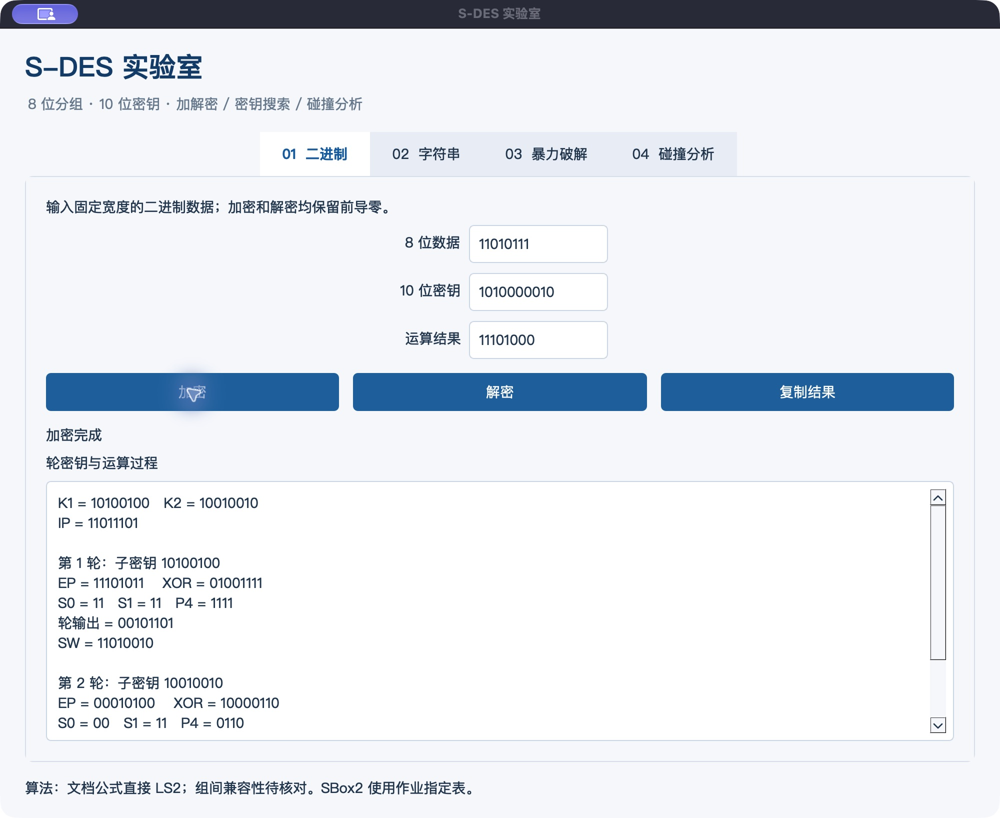

# S-DES 实验室

《信息安全导论》作业 1 的 Python + PySide6 桌面实现：二进制加解密、ASCII 字符串、全部候选密钥搜索、单明文及全空间碰撞分析，支持运算轨迹、后台任务、取消、计时和 JSON/CSV 导出。

## 当前状态

2026-10-06：首版已实现并在当前 macOS 实际启动。32 项自动测试通过，应用代码覆盖率约 91%；262144 个密钥/分组组合往返通过，真实窗口截图及分析数据已保存。

**当前按文档公式实现直接 LS2**：两轮从 P10 原始结果分别左移 1、2 位。课堂位移约定和其他组的兼容性仍待确认；组间交叉测试未完成。SBox2 按作业表实现，行 `10`、列 `11` 为 `2`。

## 运行

当前电脑可双击 `S-DES.app`；也可双击 `启动.command`。`.app` 是依赖本项目虚拟环境的本地启动快捷入口，不是独立安装包。

在项目根目录使用 uv：

```sh
uv sync --frozen
uv run --frozen sdes-lab
```

项目锁定 Python 3.13，当前验证环境为 Python 3.13.13 / PySide6 Essentials 6.11.2。只安装本工具需要的 Qt Essentials 模块，仍使用 `PySide6` API。

## 测试与复现

```sh
uv sync --frozen --extra dev
uv run --frozen --extra dev pytest -q --cov=sdes
uv run --frozen --extra dev ruff check .
uv run --frozen python collect_evidence.py
```

`collect_evidence.py` 重建数值证据，会覆盖同名的数值结果文件；保留 GUI 截图、手工保存的结果及动图。其他平台尚未实际验收。

## 文档和结果

- [设计文档](docs/design.md)
- [用户指南](docs/user-guide.md)
- [开发手册](docs/developer-guide.md)
- [测试报告](docs/test-report.md)
- [开发任务](docs/tasks.md)
- [数值汇总](evidence/summary.json)
- [破解前后对照动图](evidence/bruteforce/demo.gif)：真实窗口截图合成；播放时长不是计算耗时。



## 作业交付

[GitHub 公开仓库](https://github.com/yoyuzh/sdes-lab)于 2026-10-07 创建并上传，包含源码、文档、测试和证据，可供其他组及教师直接访问。

[原始作业](https://shimo.im/docs/m5kvdlMaKvcENy3X)。截止时间为 2026-10-08 23:00（北京时间）。当前尚未填写提交表或完成真实组间交叉测试。
