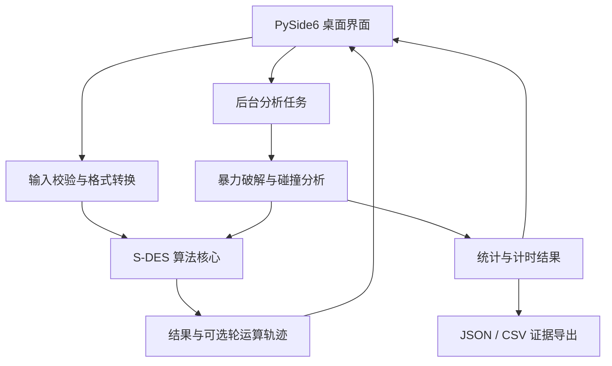

# S-DES 加解密与分析工具设计文档

版本：0.2 · 日期：2026-10-06 · 状态：首版已实现；课堂位移约定与组间交叉待确认

实施记录：Python 3.13.13 / PySide6 Essentials 6.11.2；四个功能页、算法核心、后台分析及导出已完成。实际结果见 [测试报告](test-report.md)。

需求来源：[作业1：S-DES算法实现](https://shimo.im/docs/m5kvdlMaKvcENy3X)，于 2026-10-06 核对正文及参数图表。
提交截止：2026-10-08 23:00（北京时间）。

## 1. 目标与范围

开发一个面向课程实验的桌面工具，用同一套 S-DES 算法完成二进制加解密、ASCII 字符串加解密、已知明密文对的密钥枚举，以及密钥碰撞分析。最终交付可运行源码、五关测试证据、用户指南和开发手册。

本项目使用 Python + PySide6，算法层不依赖 GUI，测试使用 pytest。源码要求 Python 3.11 或以上；当前解释器为 Python 3.13.13，PySide6 Essentials 6.11.2，依赖由 uv.lock 锁定。当前 macOS 已实际验收，其他平台只有经过运行验收后才列为已支持。

首版必须覆盖五个关卡。TCP 通信、中文 UTF-8 模式、安装包及并行加速作为后续扩展；后台线程保持界面响应，但不据此宣称破解速度提升。

## 2. 需求与完成标准

| 编号 | 作业要求 | 产品行为 | 验收证据 |
|---|---|---|---|
| R1 | 8-bit 分组、10-bit 密钥、GUI | 加密与解密均可交互操作，保留前导零 | GUI 截图、固定向量、穷举往返结果 |
| R2 | 与另一组交叉测试 | 相同参数和输入得到相同密文，可互相解密 | 对方组别、环境、输入、双方输出和截图 |
| R3 | ASCII 字符串扩展 | 每字节独立加解密，提供原始密文字节的可视预览及 Hex 表示 | 字符串往返、控制字符、错误输入结果 |
| R4 | 一个或多个明密文对暴力破解 | 枚举 1024 个密钥，返回全部匹配者、进度与耗时 | 原始结果文件、录屏或动图 |
| R5 | 多密钥及碰撞分析 | 按给定明文分组统计各密文对应的密钥；可遍历全部明文 | 碰撞实例、256 行统计表、结论 |
| R6 | 代码规范及提交材料 | 模块化、明确命名、必要注释、可复现文档 | 源码、测试报告、用户指南、接口文档 |

自动化测试通过、桌面操作通过、其他组交叉测试通过分别记录。自己的第二份实现只能提供独立回归证据，不能代替真实的组间交叉测试。

## 3. 算法规范

### 3.1 数据与位序

- 分组为 8 位，整数范围 0–255；主密钥为 10 位，整数范围 0–1023。
- 文档中置换下标从 1 开始，最左侧位为第 1 位；代码内部须统一转换，禁止混用下标体系。
- 内部使用整数和固定宽度位运算；界面使用定长二进制字符串。轮密钥宽度为 8 位。
- 所有轮运算和子密钥计算由同一算法模块提供，不在 GUI 中重复实现。

### 3.2 已核对的转换表

下列数据直接记录自作业文档。实现时保存为不可变常量，并逐项测试。

| 名称 | 置换序列（从 1 开始） |
|---|---|
| P10 | 3, 5, 2, 7, 4, 10, 1, 9, 8, 6 |
| P8 | 6, 3, 7, 4, 8, 5, 10, 9 |
| IP | 2, 6, 3, 1, 4, 8, 5, 7 |
| IP⁻¹ | 4, 1, 3, 5, 7, 2, 8, 6 |
| EP | 4, 1, 2, 3, 2, 3, 4, 1 |
| P4（文档 SPBox） | 2, 4, 3, 1 |
| 五位循环左移 1 位 | 2, 3, 4, 5, 1 |
| 五位循环左移 2 位 | 3, 4, 5, 1, 2 |

SBox1（实现中命名 S0）：

| 行 / 列 | 00 | 01 | 10 | 11 |
|---|---:|---:|---:|---:|
| 00 | 1 | 0 | 3 | 2 |
| 01 | 3 | 2 | 1 | 0 |
| 10 | 0 | 2 | 1 | 3 |
| 11 | 3 | 1 | 0 | 2 |

SBox2（实现中命名 S1）：

| 行 / 列 | 00 | 01 | 10 | 11 |
|---|---:|---:|---:|---:|
| 00 | 0 | 1 | 2 | 3 |
| 01 | 2 | 3 | 1 | 0 |
| 10 | 3 | 0 | 1 | 2 |
| 11 | 2 | 1 | 0 | 3 |

**SBox2 必须以作业文档为准。** 行 `10`、列 `11` 的值为 `2`；完整表均已录入并测试，不能直接复制其他 S-DES 示例的常量。

### 3.3 密钥扩展及待确认项

主密钥经过 P10 后，分成左右两个 5 位部分，每部分独立循环左移。经 P8 得到 K1 和 K2。

文档给出 `k_i = P8(Shift^i(P10(K)))`，并列出了左移 1 位、左移 2 位的序列，但未明确第二次左移的起点。需要在算法定稿前通过课程材料或另一组的独立向量确认：

| 解释 | K1 | K2 |
|---|---|---|
| 直接按公式的位移次数解释 | P10 后左右各左移 1 位，再 P8 | 从 P10 后的原始两半各左移 2 位，再 P8 |
| 顺序执行两次位移解释 | P10 后左右各左移 1 位，再 P8 | 在首次左移结果上再左移 2 位，再 P8，累计 3 位 |

首版采用公式的字面解释：从 P10 原始结果分别左移 1、2 位，版本为 `shimo-direct-ls2-v1`。这是为推进实现所作的明确设计选择，尚未获得课程材料或其他组的确认。非周期密钥 `1010000010` 生成 K1=`10100100`、K2=`10010010`；明文 `11010111` 得到 `11101000`。累计 3 位解释则得到 K2=`01000011`、密文 `10101000`，可以据此核对。自加密、自解密成功无法证明课程兼容性，交叉测试仍保留为待验收项。最终界面使用一种算法，不向用户提供歧义模式切换。

### 3.4 轮函数与加解密

对输入分组做 IP，得到左右各 4 位的 L、R。

1. 用 EP 将 R 扩展成 8 位，与当前轮密钥异或。
2. 分成左右各 4 位，分别送入 S0 和 S1。
3. 每个 S 盒的行号由第 1、4 位组成，列号由第 2、3 位组成，输出保留为 2 位。
4. 合并两个 S 盒输出并做 P4，得到 F(R, K)。
5. 轮函数返回 `(L XOR F(R, K), R)`。

加密流程：`IP → f(K1) → SW → f(K2) → IP⁻¹`。
解密流程：`IP → f(K2) → SW → f(K1) → IP⁻¹`。
SW 只交换一次；第二轮结束后直接做 IP⁻¹。

### 3.5 字节与字符串

- 文本加密输入严格采用 ASCII（0–127），非 ASCII 字符应显示位置和原因，不进行隐式截断或替换。
- 每字节单独加密，不添加填充；输出字节数与输入字节数相同。
- 密文字节可为 0–255，不能按严格 ASCII 解码。以 Hex 为默认可复制表示；字符预览按字节值展示可打印部分，对控制字符使用转义。
- 解密接收 Hex，支持连续形式及字节间空白，拒绝奇数个十六进制数字及其他非法字符。空字符串往返为空字节串。
- 原始字节是权威结果，Hex 和字符预览只是表示方式。解密得到非 ASCII 字节时保留 Hex，并提示无法作为 ASCII 明文显示。

## 4. 架构与目录



下列 Python 文件、运行配置和指南已创建。实际项目还包括依赖锁文件、启动脚本、本地 macOS 启动快捷入口及数值证据生成脚本。

```text
sdes-project/
├── README.md
├── docs/
│   ├── design.md                # 本设计文档
│   ├── tasks.md                 # 开发顺序与状态
│   ├── test-report.md           # 验收结果登记
│   ├── user-guide.md            # 已编写
│   └── developer-guide.md       # 已编写
├── src/sdes/
│   ├── constants.py            # 置换和 S 盒
│   ├── core.py                 # 纯函数算法及轨迹
│   ├── codecs.py               # 位串、ASCII、Hex
│   ├── analysis.py             # 破解、碰撞、计时
│   ├── export.py               # 结构化结果导出
│   ├── gui.py                  # 主窗口和功能页
│   ├── workers.py              # Qt 后台任务与取消
│   └── __main__.py             # 启动入口
├── tests/                      # 核心、服务与 Qt 集成测试
├── evidence/
│   ├── basic/
│   ├── cross/
│   ├── text/
│   ├── bruteforce/
│   └── collision/
└── pyproject.toml              # 项目配置，uv.lock 锁定依赖
```

依赖方向：界面依赖业务和转换模块；分析模块依赖核心；核心不依赖 Qt、文件系统或全局 UI 状态。轮密钥每个密钥计算一次，字节批量处理复用它们。

## 5. 模块接口约定

以下接口已实现；具体类型和约束见 [开发手册](developer-guide.md)。

| 模块 | 接口 | 约定 |
|---|---|---|
| core | `derive_subkeys(key) -> tuple[int, int]` | 主密钥 0–1023；返回两个 8 位轮密钥 |
| core | `encrypt_block(block, key) -> int` | 分组 0–255；返回 0–255 |
| core | `decrypt_block(block, key) -> int` | 同上，轮密钥逆序 |
| core | `encrypt_bytes(data, key) -> bytes` | 空输入合法；保持长度 |
| core | `decrypt_bytes(data, key) -> bytes` | 处理全部 0–255 字节 |
| core | `trace_block(block, key, operation) -> BlockTrace` | 返回实际运算轨迹，不额外维护算法副本 |
| codecs | `parse_bits(text, width) -> int` | 去除首尾空白后仅允许定长 0/1 |
| codecs | `parse_hex(text) -> bytes` | 空输入合法；非法 Hex 报错 |
| analysis | `brute_force(pairs, progress, cancelled) -> SearchResult` | 至少一对；遍历完整密钥空间 |
| analysis | `analyze_plaintext(block, progress, cancelled) -> CollisionResult` | 输出密文到密钥列表的映射 |
| analysis | `analyze_all_plaintexts(progress, cancelled) -> FullAnalysisResult` | 遍历 256 个分组，汇总每个分组统计 |

纯算法参数越界、格式错误统一抛出带明确原因的 `ValueError`；GUI 捕获预期输入错误并就地显示。其他运行错误保留诊断信息，不能静默返回空结果。

主要结果模型：

- `BlockTrace`：操作、输入、主密钥、K1/K2、IP、各轮 EP/异或/S 盒/P4、交换、最终输出。
- `SearchResult`：输入对、按数值排序的候选密钥、已检查数量、开始/结束时间、耗时、完成或取消状态、算法版本。
- `CollisionResult`：明文、密文分桶、已遍历密钥数、可达密文数、碰撞桶数、最大桶大小、耗时和状态。
- `FullAnalysisResult`：256 个分组的摘要、全局汇总、状态和算法版本；详细桶映射按需生成。

只有完整遍历产生的结果可标记为“完整分析”。取消任务的结果须标记“未完成”，不能用于证明唯一密钥或完整碰撞统计。

## 6. 界面与交互

主窗口使用四个标签页，共享统一的输入校验、结果格式和错误提示。

| 页面 | 输入 | 操作 | 输出 |
|---|---|---|---|
| 二进制加解密 | 8 位数据、10 位密钥 | 加密、解密、复制、展开过程 | 8 位结果、K1/K2、可选轨迹 |
| 字符串加解密 | ASCII 文本或 Hex 密文、10 位密钥 | 加密、解密、复制 | Hex、字节预览、恢复文本、字节数 |
| 暴力破解 | 可添加/删除的明文及密文行 | 开始、取消、导出 | 检查进度、候选列表、候选数、耗时 |
| 碰撞分析 | 8 位明文或“全部明文” | 开始、取消、查看桶、导出 | 统计表、碰撞实例、密钥列表 |

交互细节：

- 二进制输入提示精确位数，输出始终保留前导零；错误指出对应字段。
- 分析执行时禁用重复启动，输入快照固定；进度更新节流，避免频繁信号阻塞 UI。
- 后台线程通过 Qt 信号提交结果，不直接访问界面控件。取消标志在密钥或分组迭代边界检查。
- 用单调计时器记录计算耗时，墙上时钟记录开始和结束时间；耗时范围包括算法所需准备和枚举，排除文件导出及界面绘制。
- 候选为零时提示“无匹配密钥，请检查输入对或算法参数”；多个时提示“当前数据无法唯一确定密钥”，支持继续添加明密文对。
- 未完成、完整完成和失败的状态有明确文字区分。大规模密钥列表按选择展开，防止一次绘制数万行。

## 7. 暴力破解与碰撞分析方法

### 7.1 暴力破解

按 `0000000000` 到 `1111111111` 枚举 1024 个密钥。对每个密钥生成轮密钥，逐个验证所有 `(P, C)`；某一对不匹配即可跳过该密钥。所有明密文对均匹配时记录候选，继续遍历，不在首个匹配处停止。

若有 m 对输入，最坏需约 `1024 × m` 次分组加密。重复输入对不能增加约束；同一明文配不同密文会形成矛盾，UI 提示并阻止启动。候选唯一只表明在已确认算法及给定数据下唯一。

### 7.2 单分组与全空间分析

对固定 P，计算全部 `E_K(P)`，按 C 分桶。桶里两个或更多密钥即为碰撞。完整统计必须满足：所有桶的密钥数之和为 1024，各密钥出现恰好一次。

对全部 P（0–255）重复此过程，共 262144 次分组加密。输出每个 P 的可达密文数、碰撞桶数、最大桶大小及至少一个可复现碰撞实例。不要把“碰撞桶数量”“参与碰撞的密钥数量”和“碰撞密钥对数量”混作同一指标。

对于任意固定 P，1024 个密钥映射到最多 256 个密文，根据抽屉原理必然存在至少两个密钥得到相同密文。这个结论是结构推导；具体分布、哪些密钥碰撞，以及随机抽到的某一个 `(P,C)` 是否有多个候选，仍须实际计算。不能推断每个 `(P,C)` 都恰好有 4 个密钥。

## 8. 验证计划

### 8.1 算法正确性

1. 对置换函数使用可手算输入，核对位序；对全部 256 个分组验证 IP 和 IP⁻¹ 互逆。
2. 逐项验证两个 S 盒的 16 个输入和行列索引。
3. 密钥位移语义确认后，记录手算或独立来源的轮密钥、轮中间值和密文固定向量；测试禁止调用被测函数生成期望值。
4. 全部 1024 个密钥、256 个分组验证 `D_K(E_K(P)) = P`，并验证每个密钥下密文构成 0–255 的排列。该检查证明内部往返性质，不能单独证明符合课程标准。

### 8.2 格式和分析行为

- 二进制测试包括全零、全一、前导零、长度错误和非二进制字符。
- 字符串测试包括空串、普通英文、换行、ASCII 边界、非 ASCII 拒绝、非法 Hex；字节核心覆盖 0–255。
- 破解测试包括单对、多对、无解、唯一或多个候选、重复及矛盾输入；每个返回候选重新验证，检查没有漏掉密钥。
- 碰撞测试检查桶总数与密钥计数守恒、全部明文覆盖范围，并重新加密碰撞实例。
- 后台任务测试重点验证开始/完成/取消/失败状态，保证取消不能显示完整结论。

### 8.3 实际验收

在当前 macOS 实际启动 GUI，执行加密、解密、文本往返、破解、碰撞分析、取消和导出，观察保存结果。录制破解过程时必须显示输入、进度、开始/结束时间、耗时及候选密钥。

与另一组使用至少一个确定的公共向量交叉验证，建议覆盖多个密钥、多个分组和双向解密。记录对方算法参数、运行环境及结果；对方未参与前，R2 状态保持“待交叉验收”。

## 9. 文档与证据格式

- `README.md`：项目目的、当前状态、安装运行和文档入口。
- `docs/user-guide.md`：环境准备、运行方式、四页操作说明、输入示例和错误处理。
- `docs/developer-guide.md`：算法常量、位移决策、接口、模块关系、测试与导出结构。
- `docs/test-report.md`：五关的测试条件、实际结果、证据路径及未完成事项。
- `evidence/`：按关卡保存截图、向量、JSON、CSV 和录屏；所有数值来自实际执行。

JSON 导出包含算法版本、运行环境、输入、状态、结果及计时元数据。CSV 用 UTF-8，二进制字段保留定长字符串；表格工具可能去掉前导零，JSON 作为精确数据依据。导出失败明确报告，不能显示“已保存”。

## 10. 实施顺序与协作

| 阶段 | 内容 | 进入下一阶段的条件 |
|---|---|---|
| M0：设计与初始化 | 设计、目录、任务与验收登记 | 已完成 |
| M1：算法核心 | 按公式采用 direct LS2、实现常量/加解密/轨迹、固定向量与穷举 | 首版实现和测试通过；课堂位移约定待确认 |
| M2：交互和文本 | GUI 基本页、ASCII/Hex 页、实际启动 | 基本操作和文本往返通过 |
| M3：破解与分析 | 枚举、碰撞、后台任务、计时及导出 | 完整结果及取消流程通过 |
| M4：验收与提交材料 | 组间交叉、五关证据、录屏、指南与开发文档 | 实际验收并检查仓库材料 |

二人建议分工：成员 A 负责算法核心、固定向量和分析逻辑；成员 B 负责 GUI、交叉测试协调和证据整理。双方共同确认参数及接口。人员尚未指定，不假设已有另一组参考实现。

风险处理：位移解释已作为带版本的实施决策记录，课堂兼容性仍待外部证据；SBox2 按本文常量复核；密文不可打印用 Hex 和转义预览处理；分析任务后台执行。当前 macOS 运行和测试已验收，其他平台尚未实际验收；扩展功能后置。

最终完成条件：五关全部有可复核证据，算法参数依据明确，源码可按指南启动，仓库包含必要文档，并在截止前完成指定表格的链接提交。2026-10-07 已创建并上传 [GitHub 公开仓库](https://github.com/yoyuzh/sdes-lab)，尚未在指定表格提交作业。
